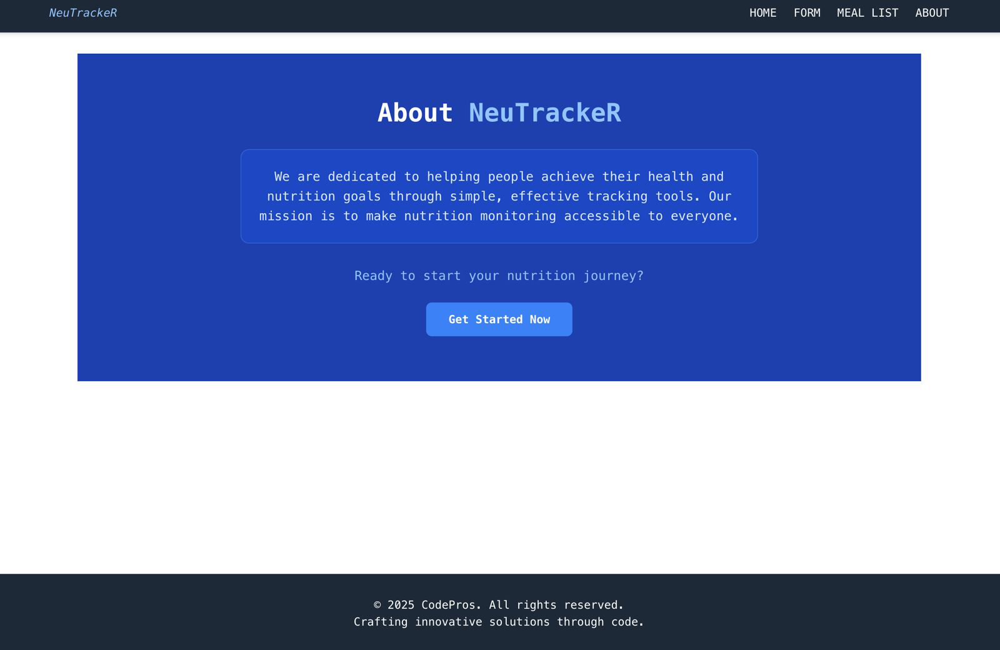
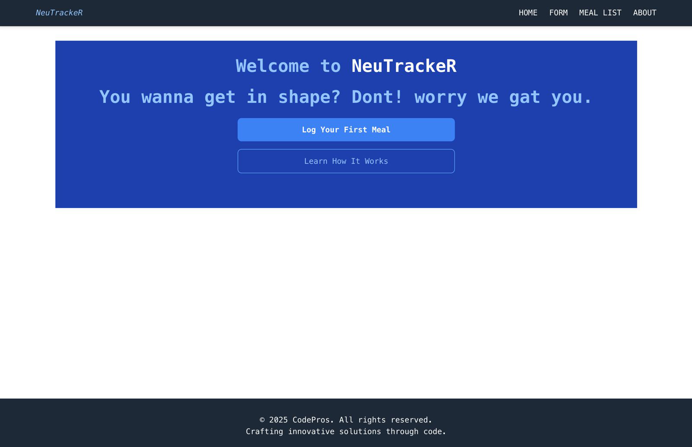
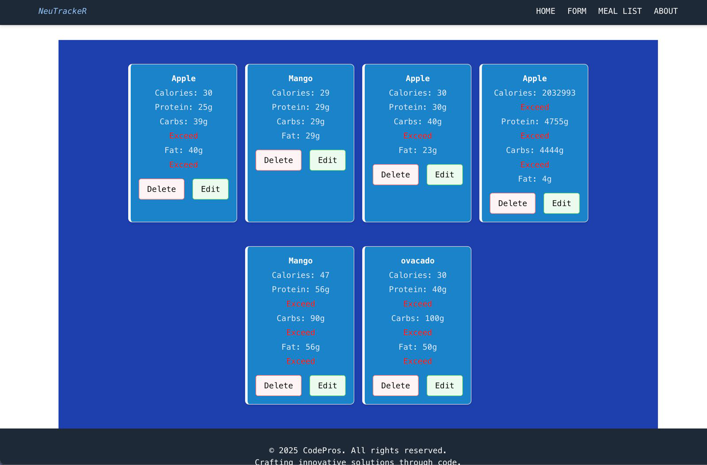
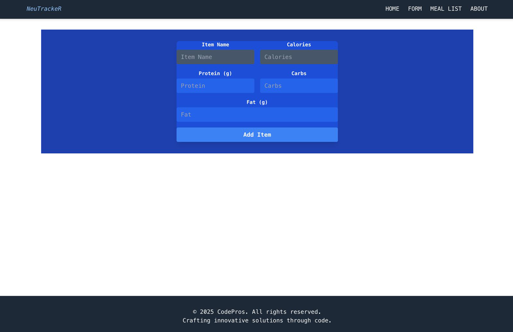

# Nutrition Tracker App

A simple React-based nutrition tracker that allows users to log meals and track their calories, protein, carbs, and fat intake.

### Frontend (Vercel):

https://nutrition-meter-application.vercel.app/

### Backend API (Render):

https://nutrition-api-nyjf.onrender.com/nutritions

## Features

- Add meals with nutritional info (calories, protein, carbs, fat)
- View list of all added meals
- Basic routing using React Router
- JSON Server used as a mock API
- Deployed backend on Render

## Tech Stack

- Frontend: React (with Hooks), React Router
- Backend/API: JSON Server
- Deployment: Render (for the API)

## Project Structure

**src/**

_components/_

- Card.css

- MealItem.js

- MealList.js

_pages/_

- About.js

- Home.js
- Layout.js
- MealForm.js

- App.css
  App.js
  index.js
  index.css
- package-lock.json
- package.json

- README.md

## Getting Started

1. Clone the repository

   ```bash
   git clone https://github.com/daganeabdul/nutrition-api.git

   cd nutrition-api

   ```

2. Install dependencies

   ```bash
   npm install

   ```

3. Run locally with JSON Server

   ```bash
    npx json-server db.json --port 3000

   ```

If you want to run it locally:

        `npm start`

Or, update your package.json like this:
`"scripts": {
      "start": "json-server db.json --port 3000"
       }`

Then run:

    `npm start`

4. App Entry Point

   Visit http://localhost:3000 after starting the dev server.

## API Endpoints

- GET /nutritions - // Get all meals
- POST /nutritions - // Add a new meal

### Example of a meal object:

{

"itemName": "Chicken Breast",

"calories": "165",

"protein": "31",

"carbs": "0",

"fat": "3.6"

}

## Screenshots









## Contribution

Contributions are welcome!

**Fork the repo, make your changes, and submit a PR.**

## MIT License

COPYRIGHT AND OWNERSHIP NOTICE

© Copyright 2025 Oliver Ekenp. All Rights Reserved.

This software, including its source code, documentation, and all associated files (the "Work"), is the intellectual property of Oliver Ekenp. The Work is protected by copyright law and international treaties.

No part of the Work may be copied, modified, distributed, published, sold, sublicensed, or used for any purpose, commercial or non-commercial, without the express prior written permission of the author, Oliver Ekenp.

Any unauthorized use, reproduction, or distribution of this Work is strictly prohibited and will constitute a violation of copyright law. Legal action may be pursued to the fullest extent possible.

For permission requests, please contact the author directly.

# Neutracker-application
